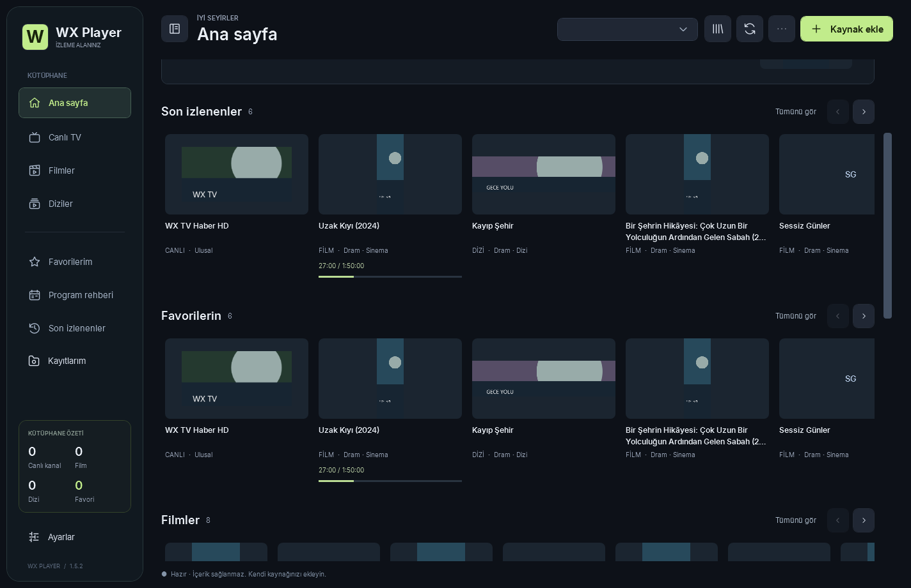

<div align="center">

# WX Player

### Kendi kaynağınız. Kendi kütüphaneniz.

Windows için modern, yerel IPTV ve medya oynatıcısı.<br>
Canlı TV, filmler ve diziler — tek bir kütüphanede.

<p>
  <a href="docs/RELEASE-NOTES-1.6.0.md"></a>
  
  
  <a href="LICENSE"></a>
</p>

<p>
  <a href="https://github.com/schwairex/WX-Player/releases/latest"></a>
  <a href="https://github.com/schwairex/WX-Player/actions/workflows/windows.yml"></a>
  
  
</p>

**[Son sürümü indir](https://github.com/schwairex/WX-Player/releases/latest)** · **[Kurulum](#kurulum)** · **[Özellikler](#ozellikler)** · **[Sürüm geçmişi](#surum-gecmisi)** · **[Sorun bildir](https://github.com/schwairex/WX-Player/issues)**


<sub>Örnek test kütüphanesi. Gerçek kullanımda içerikler, afişler ve kanal logoları kendi kaynağınızdan gelir.</sub>

</div>

---

WX Player; M3U oynatma listelerinizi, Xtream Codes hesabınızı ve uyumlu Stalker portalınızı bir araya getirir. Kaynaklardan gelen kanalları, filmleri ve dizileri yerel kütüphanenize kaydeder; favoriler, yayın rehberi ve kaldığınız yerden devam etme özellikleriyle izlemeyi kolaylaştırır.

Uygulama **kanal paketi, IPTV aboneliği veya içerik sunucusu sağlamaz**. Kendi erişim hakkınız bulunan kaynakları ekleyerek kullanabilirsiniz. C# / WPF ile geliştirilen istemci, katalog ve veri katmanları WX Player'a; medya oynatma altyapısı açık kaynak LibVLC'ye dayanır.

> **1.6.0'da yenilik:** Dizi izlerken sezon/bölüm paneli, tam ekranda son 30 saniyede sonraki bölüm önerisi ve eksik afiş/logoları otomatik tamamlama. [1.6.0 sürüm notları →](docs/RELEASE-NOTES-1.6.0.md)

> **1.5.3'te yenilik:** Kartların üzerinde kesintisiz sayfa kaydırma, kalıcı afiş önbelleği, ana sayfada yalnız yüklenebilen görseller ve daha düzenli 2:3 film/dizi kartları. [Sürüm notları →](docs/RELEASE-NOTES-1.5.3.md)

## İçindekiler

- [Öne çıkan özellikler](#ozellikler)
- [Kurulum ve ilk kullanım](#kurulum)
- [Kütüphane ve ana sayfa](#kutuphane)
- [Oynatıcı, EPG ve kayıt](#oynatici)
- [Klavye ve fare kısayolları](#kisayollar)
- [Otomatik güncelleme](#guncelleme)
- [Yerel veriler ve gizlilik](#veriler)
- [Sık sorulan sorular](#sss)
- [Geliştirme, test ve yayınlama](#gelistirme)
- [Sürüm geçmişi](#surum-gecmisi)
- [Katkıda bulunma ve lisans](#katki)

<a id="ozellikler"></a>
## Öne çıkan özellikler

| Alan | WX Player ile yapabilecekleriniz |
| :--- | :--- |
| **Kaynaklar** | Yerel dosya veya URL ile M3U / M3U8 / TXT; Xtream Codes API; uyumlu Stalker / MAG portalları. |
| **Büyük kütüphaneler** | 100.000+ içerik için asenkron içe aktarma, iptal desteği, SQLite katalog, sayfalama ve sanallaştırılmış listeler. |
| **Ana sayfa** | Kaynağınızdan öneriler, Filmler, Diziler, Şimdi canlı, Son izlenenler ve Favorilerin rafları. |
| **Arama ve filtreler** | Türkçe karakterleri sadeleştiren arama; kaynak, tür, kategori, favori ve geçmiş filtreleri. |
| **Afişler ve logolar** | Arka planda yükleme, aynı adres için tek indirme, bellek ve disk önbelleği; düzenli afiş ve logo kartları. |
| **Favoriler ve devam etme** | Normal/tam ekran görünümünde favoriye ekleme; filmin dakikasını ve dizinin son bölümünü/konumunu kaydetme. |
| **Yayın rehberi** | XMLTV / XMLTV.gz, kanal eşleştirme, şimdi/sıradaki program, gün seçimi ve Xtream EPG desteği. |
| **Canlı geri sarma** | Uyumlu HTTP/HTTPS yayınlarda biriken son 60 saniyeye kadar yerel tampon ve tek tıkla canlıya dönüş. |
| **PVR ve Catch-Up** | Manuel yayın kaydı; sağlayıcı destekliyorsa geçmiş programı arşivden tekrar izleme. |
| **Windows medya motoru** | LibVLC, Direct3D 11/9 video çıkışı, D3D11VA donanım çözme ve yazılım çözme seçeneği. |
| **Ses ve altyazı** | Çoklu ses/altyazı parçası seçimi; harici SRT, ASS, SSA, VTT ve SUB dosyaları. |
| **Tam ekran** | Otomatik gizlenen kontroller; içerik, kategori ve arama paneli; oynatma sırasında favori yönetimi. |
| **Yayın istatistikleri** | Sunulan verilere göre codec, çözünürlük, FPS, ses bilgisi, giriş hızı ve video sayaçları. |
| **Masaüstü deneyimi** | Inter yazı tipi, SVG simgeler, koyu tema, daraltılabilir sol menü ve pencereye uyarlanan düzen. |
| **Güncellemeler** | GitHub Releases kontrolü, arka planda indirme, SHA-256 doğrulaması ve kullanıcı seçimiyle yeniden başlatma. |

<a id="kurulum"></a>
## Kurulum ve ilk kullanım

### Sistem gereksinimleri

| Gereksinim | Açıklama |
| :--- | :--- |
| İşletim sistemi | Windows 10 / 11, **64 bit (x64)**. Windows 11 önerilir. |
| Çalışma zamanı | Dağıtım .NET 10 çalışma zamanını ve LibVLC'yi içerir; ayrıca .NET 10 veya VLC kurmanız gerekmez. Tek EXE başlatıcısı Windows'un .NET Framework 4.x bileşenini kullanır. |
| Disk alanı | Tek EXE'nin ilk açılışta açılması için yaklaşık 500 MB boş alan; afiş önbelleği ve kayıtlar için ek alan. |
| Bağlantı | Çevrimiçi yayınlar, kaynak yenileme, afiş/EPG indirme ve güncelleme kontrolü için internet. |
| Grafik donanımı | Donanım çözme desteği ekran kartına, sürücüye ve yayın codec'ine bağlıdır; yazılım çözme seçilebilir. |

### Seçenek 1 — Tek EXE

1. **[Releases sayfasını](https://github.com/schwairex/WX-Player/releases/latest)** açın.
2. Sürümün **Assets** bölümünden `WXPlayer-1.5.3.exe` veya o sürüme ait `WXPlayer.exe` dosyasını indirin.
3. EXE'yi çalıştırın. İlk açılışta dosyalar kullanıcı klasörüne açılır; sonraki açılışlarda bu dosyalar kullanılır.
4. **Kaynak ekle** düğmesiyle kütüphanenizi bağlayın.

Yönetici yetkisi isteyen bir sistem kurulumu yapılmaz. Uygulama dosyaları `%LOCALAPPDATA%\WXPlayer\application` altında tutulur. Dağıtım EXE'si şu anda kod imzalı değildir; yayımlanan `SHA256SUMS` dosyasıyla bütünlüğünü kontrol edebilirsiniz. Sağlama toplamı, kod imzasının yerine geçmez.

### Seçenek 2 — Taşınabilir ZIP

1. Releases içinden `WXPlayer-1.5.3-portable.zip` veya `WXPlayer-win-x64.zip` dosyasını indirin.
2. ZIP'in **tamamını** bir klasöre çıkarın.
3. Klasördeki `WXPlayer.exe` dosyasını çalıştırın.

ZIP içindeki küçük EXE'yi tek başına taşımayın; yanındaki çalışma zamanı ve medya dosyaları gereklidir. Taşınabilir dağıtım da kullanıcı verilerini varsayılan olarak `%LOCALAPPDATA%\WXPlayer` altında saklar. GitHub'ın otomatik oluşturduğu **Source code** arşivleri hazır uygulama değildir.

### Kaynağınızı bağlayın

| Kaynak türü | Gireceğiniz bilgi | Yüklenen içerik |
| :--- | :--- | :--- |
| **M3U / M3U8 / TXT** | Oynatma listesi URL'si veya yerel dosya | Listedeki kanallar, filmler ve tanınabilen dizi bölümleri; kategori, logo ve rehber bilgileri. |
| **Xtream Codes** | Sunucu adresi, kullanıcı adı ve şifre | Canlı TV, film ve dizi kategorileri; dizi seçildiğinde bölüm listeleri. Desteklenen `get.php` bağlantılarından hesap bilgileri ayrıştırılabilir. |
| **Stalker / MAG** | Portal adresi ve hesabınıza tanımlı MAC adresi | Portalın sunduğu uyumlu kanal, film ve temel dizi katalogları. |
| **DirectShow** | Windows kamera/yakalama aygıtının tam adı | Yerel yakalama aygıtından görüntü; otomatik aygıt keşfi bulunmaz. |

İçe aktarma arka planda sürer. Bittiğinde kaynak seçicisinden kütüphanenizi seçin; **Canlı TV**, **Filmler** veya **Diziler** bölümünü açın. Kaynakta EPG adresi varsa rehber arka planda hazırlanır; gerektiğinde ayrıca XMLTV URL'si veya dosyası tanımlayabilirsiniz.

M3U ayrıştırıcı UTF-8/BOM, `EXTINF`, grup, `tvg-id`, `tvg-name`, logo, rehber adresi, göreli URL, kullanıcı aracısı ve referrer bilgilerini destekler. HLS medya/master manifestleri tek oynatılabilir akış olarak ele alınır. Stalker portallarının cihaz kimliği ve oturum gereksinimleri değişebildiğinden her portal varyantı desteklenmeyebilir.

<a id="kutuphane"></a>
## Kütüphane ve ana sayfa

### İçeriğinize odaklanan tasarım

Ana sayfa seçili kaynaktan beslenir. Üst öneri açılışta seçilir; alternatif varsa önceki önerinin tekrarlanmaması hedeflenir. **Filmler** ve **Diziler** ayrı sunulur; bir dizinin bölümleri ana sayfayı doldurmak yerine tek dizi kartında toplanır. Dizi kartından sezon ve bölüm seçebilirsiniz.

Film/dizi afişleri ortak **2:3** ölçüyle, oranları bozulmadan ve gerektiğinde kenarlardan kırpılarak gösterilir. Kanal logoları tamamı görünecek biçimde sığdırılır. Öneri alanının yüksekliği sınırlıdır; aynı raftaki farklı içerik türlerinin kartları hizalı kalır.



**1.5.3'te ana sayfaya yalnız başarıyla yüklenen afiş ve logolar alınır.** Afişsiz veya görseli bozuk içerikler silinmez; tam kütüphanede, favorilerde ve geçmişte erişilebilir. Boş raflar gizlenir. Raf başına en fazla 12 kart gösterilir; **Tümünü gör** tam listeyi açar. Harici katalogdan içerik veya puan üretilmez.

### Daha rahat gezinme

- Kartların üzerindeki normal fare tekerleği ana sayfayı aşağı/yukarı kaydırır. **Shift + tekerlek** ilgili rafı yatay kaydırır; raf okları da kullanılabilir.
- Kaynak veya arama değiştiğinde sayfa başa döner; aynı görünüm yenilenirken kaydırma konumu korunur.
- Sol menü W simgesi, menü düğmesi veya **Ctrl+B** ile daraltılıp genişletilir. Tercih sonraki açılışta korunur.
- Arama 250 ms beklemeyle çalışır; önceki sorgular iptal edilerek eski sonuçların yeni aramanın üzerine gelmesi önlenir.
- Büyük kataloglar SQLite üzerinde tutulur. Tam listelerde 150 satırlık sayfalama ve WPF sanallaştırması kullanılır. Başarısız/boş yenilemeler mevcut kataloğu korur.

### Afişler için akıllı önbellek

Aynı görsel adresi farklı kart boyutlarında kullanıldığında tek ağ indirmesi paylaşılır. Yükleme ve çözme arka planda, sınırlı eşzamanlılıkla yürütülür. **64 MB hedefli LRU bellek önbelleği** sık kullanılan afişleri tutar; disk önbelleği sonraki açılışları hızlandırır. Disk temizliği 192 MB hedefi ve 7 günlük yaş sınırıyla yapılır.

Bozuk görseller kısa süre içinde tekrar tekrar indirilmez; dosya ve çözülen görsel boyutları sınırlandırılır. İlk yükleme süresi sağlayıcının yanıt hızına bağlıdır.

### Favoriler ve kaldığınız yer

Yıldız düğmesiyle içerikleri favorileyebilirsiniz; tam ekran seçim panelinde favori eklemek yayını değiştirmez. Film için dakika, dizi için son izlenen bölüm ve dakika kaydedilir. Yeniden açılan içerik ileri/geri sarma destekliyorsa kayıtlı konumdan devam eder; bölüm penceresinden **Baştan oynat** seçilebilir.

Konum kaydı 1.5.1 ile başlamıştır; daha eski izlemeler için geriye dönük dakika bilgisi bulunmaz. **İzleme geçmişini temizlemek devam etme konumlarını da temizler.**

<a id="oynatici"></a>
## Oynatıcı, EPG ve kayıt

### Tam ekran, ses ve görüntü

Tam ekran görünümü monitörü kaplar; kontroller video üzerine yerleşir ve fare hareketsizken otomatik gizlenir. Fareyi hareket ettirerek oynatma çubuğuna ve kategori/içerik paneline ulaşabilirsiniz. Panelden arama yapabilir, içerik değiştirebilir ve favorilerinizi yönetebilirsiniz.

**Z** ile görüntüyü sığdırma ve ekranı doldurma arasında geçiş yapılır. Doldurma modu oranı koruyarak kenarları kırpabilir; sığdırma modu görüntünün tamamını gösterir ve en-boy oranları farklıysa siyah boşluk bırakabilir. Yayının içine gömülmüş siyah bantlar otomatik algılanıp kaldırılmaz.

**Ses ve altyazılar** panelinden kaynağın sunduğu parçaları seçebilir veya harici altyazı ekleyebilirsiniz. **Yayın istatistikleri** saniyede bir yenilenir; motorun sağladığı codec, çözünürlük, kaynak FPS'i, ses örnekleme hızı/kanal bilgisi, veri hızı ve sayaçları gösterir. Bulunmayan değerler tahmin edilmez; bu panel GPU kullanım yüzdesi ölçmez. Yayın adresindeki hesap bilgileri görüntülemede maskelenir.

### XMLTV EPG Parser & Channel Matcher

Yayın akışı izlediğiniz canlı kanalı takip eder. Rehberde gün, şimdi/sıradaki/geçmiş programlar, ilerleme ve açıklama bilgileri gösterilir.

- **XMLTV ve gzip:** XMLTV / XMLTV.gz akış halinde ayrıştırılır; harici DTD kaynakları indirilmez.
- **Kanal eşleştirme:** `tvg-id`, `tvg-name` ve sadeleştirilmiş kanal adları kullanılır. Kaynaklar birbirinden ayrılır; belirsiz eşleşmeler elle seçilebilir.
- **Kaynak keşfi:** M3U başlıklarındaki rehber adresleri ve Xtream hesap bilgileri kullanılır. Manuel rehber URL'si veya yerel dosya da eklenebilir.
- **Xtream yedeği:** Uygun durumda `get_short_epg` / `get_simple_data_table` yanıtlarından rehber alınır.
- **Kararlılık:** Önbellek, yinelenen istekleri birleştirme ve hata sonrası bekleme uygulanır. Hatalı indirmeler eski rehberi silmez; önceki kanalın geç gelen yanıtı yeni kanala yazılmaz.

Rehberin bulunması ve güncelliği sağlayıcının verilerine bağlıdır. Bir M3U bağlantısı tek başına EPG verisi içerme garantisi vermez.

### Canlı yayını geri sarma — 60 saniyeye kadar

Uyumlu **HTTP/HTTPS canlı yayınlarda**, kanalı açtıktan sonra yerel tampon birikir. Zaman çizgisinden veya yön tuşlarıyla tampon içinde geri gidebilir, **CANLI / Canlıya dön** düğmesiyle yayın anına dönebilirsiniz.

Tampon kanal açılmadan önceki yayını içermez; ilk saniyelerde henüz 60 saniye oluşmamıştır. Kanal değiştirilince sıfırlanır. Akış yeniden kodlanmadan yerel parçalara paketlenir; uyumsuz kaynaklarda doğrudan oynatma kullanılır. Bu özellik DRM, RTSP, UDP ve DirectShow için sunulmaz.

### PVR ve Catch-Up arasındaki fark

| Özellik | Nasıl çalışır? | Gereken koşul |
| :--- | :--- | :--- |
| **Yerel geri sarma** | Açık kanalın son 60 saniyeye kadar biriken tamponunda gezinir. | Uyumlu HTTP/HTTPS canlı akış. |
| **PVR kaydı** | Yayını TS dosyasına kaydeder; başka kanal izlemeye devam edebilirsiniz. | Uygulamanın açık kalması, yeterli disk alanı ve sağlayıcıda ikinci eşzamanlı bağlantı izni. |
| **Catch-Up / arşiv** | Geçmiş EPG programına çift tıklayarak sağlayıcının arşivinden oynatır. | Sağlayıcının o kanal ve zaman aralığı için arşiv desteği. |

PVR manuel başlatılır; uygulama kapalıyken veya zamanlanmış kayıt yapılmaz. Kayıt yeniden kodlama yerine TS'ye paketleme kullanır; codec/kaynak uyumu gereklidir. Catch-Up, Xtream timeshift ve desteklenen M3U şablonlarıyla çalışır: `{utc}`, `{utcend}`, `{duration}`, `${start}`, `${end}`. Stalker'a özel arşiv protokolü desteklenmez; Stalker kanallarında XMLTV rehberi kullanılabilir.

<a id="kisayollar"></a>
## Klavye ve fare kısayolları

| Girdi | İşlev |
| :--- | :--- |
| **Space** | Oynat / duraklat |
| **← / →** | Desteklenen akışta 10 saniye geri / ileri |
| **↑ / ↓** | Ses seviyesini 5 artır / azalt |
| **F** / **Esc** | Tam ekranı aç-kapat / tam ekrandan çık |
| **M** | Sesi kapat / aç |
| **Z** | Görüntüyü sığdır / ekranı doldur |
| **I** | Yayın istatistiklerini aç |
| **Page Up / Page Down** | Önceki / sonraki içerik |
| **Ctrl+K** | Aramaya odaklan |
| **Ctrl+B** | Sol menüyü daralt / genişlet |
| **Video üzerinde tekerlek** | Ses seviyesini değiştir |
| **Ana sayfada tekerlek** | Sayfayı aşağı/yukarı kaydır |
| **Rafta Shift + tekerlek** | İçerik rafını yatay kaydır |
| **Liste üzerinde tekerlek** | Listeyi kaydır |
| **Videoya çift tık** | Tam ekranı değiştir |
| **Geçmiş EPG programına çift tık** | Destekleniyorsa arşivden tekrar izle |

Metin ve şifre alanlarına yazarken oynatıcı kısayolları devreye girmez. Odaktaki düğmeler Space / Enter ile kullanılabilir.

<a id="guncelleme"></a>
## Otomatik güncelleme

WX Player **açılışta**, uygulama açık kaldığında **4 saatte bir** ve Ayarlar'dan elle istendiğinde [GitHub Releases](https://github.com/schwairex/WX-Player/releases) üzerinden yeni sürüm kontrolü yapar.

1. Son kararlı sürümün numarası uygulamadakinden yeniyse dağıtım EXE'si arka planda indirilir.
2. Dosyanın boyutu ve SHA-256 özeti doğrulanır. Doğrulama başarısızsa dosya çalıştırılmaz.
3. **“Yeni bir sürüm mevcut, güncellemek için uygulamayı yeniden başlatın”** penceresi gösterilir.
4. **Daha sonra** ile izlemeye devam edebilir veya **Güncelle ve yeniden başlat** seçeneğini kullanabilirsiniz.
5. Eski süreç kapandıktan sonra yeni sürüm açılır; kaynaklar, favoriler, geçmiş ve ayarlar korunur.

Aktif kayıt varken önce kaydı durdurmanız gerekir. İndirme hatası mevcut uygulamanın kullanılmasını engellemez. Taslaklar ve ön sürümler otomatik kurulmaz. **1.0 / 1.1 kullanıcıları ilk geçişi elle yapmalıdır; otomatik güncelleme 1.2 ile eklenmiştir.**

Üstteki **GitHub Release** rozeti yayımlanmış sürümü, **Windows build** rozeti GitHub Actions durumunu gösterir; bu kaynak ağacının sürümü **1.6.0**'tür. Dinamik rozetler, ilgili GitHub yayını/iş akışı mevcut olduğunda Shields.io tarafından güncellenir.

<a id="veriler"></a>
## Yerel veriler ve gizlilik

Varsayılan veri klasörü: **`%LOCALAPPDATA%\WXPlayer`**.

| Veri | Saklama biçimi |
| :--- | :--- |
| Kaynak ayarları ve hesap şifreleri | Windows DPAPI `CurrentUser` ile şifrelenir; doğrudan başka Windows hesabına/bilgisayara taşınamaz. |
| Katalog, favoriler, geçmiş, izleme konumu ve EPG | `library.db` adlı yerel SQLite veritabanı. |
| Afişler ve logolar | `artwork-cache` altında hash ile adlandırılan önbellek dosyaları. |
| Genel ayarlar | Hassas olmayan ayarları içeren `settings.json`. |
| Hata kaydı | `errors.log`; hata türü ve zaman bilgisi. Kaynak URL'leri loglanmaz. |
| Uygulama sürümleri | Tek EXE dağıtımında `application` altına açılan sürüm klasörleri. |
| Yayın kayıtları | Varsayılan olarak Videolar / WX Player; seçtiğiniz kayıt klasörüne göre değişebilir. |

**Veritabanının tamamı şifreli değildir.** M3U'dan gelen yayın URL'leri ve başlıkları SQLite içinde düz metin tutulur; URL'ye gömülü erişim anahtarları/şifreler de buna dahildir. Veritabanınızı veya gerçek abonelik adreslerinizi herkese açık GitHub deposuna yüklemeyin.

Uygulama analitik veya telemetri servisi kullanmaz. Ağ istekleri kaynak, yayın, afiş/EPG adreslerine ve güncellemeler için GitHub'a yapılır. IPTV hesap bilgileriniz GitHub'a gönderilmez.

Ayarlar'dan kaynakları, favorileri ve geçmişi temizleyebilirsiniz. Kaynak silme ilgili katalog, favori, geçmiş ve rehberi kaldırır; PVR dosyaları ayrıca yönetilir. Yedek için uygulamayı kapatıp veri klasörünü kopyalayın; DPAPI Windows kullanıcısına bağlıdır. Tam kaldırma için uygulama dosyalarını ve **verilerinizi de kaldırmak istiyorsanız** veri klasörünü silebilirsiniz.

<a id="sss"></a>
## Sık sorulan sorular

<details>
<summary><strong>Ana sayfa boş veya bazı içerikler görünmüyor.</strong></summary>

1.5.3 ana sayfası yalnız başarıyla yüklenen afiş ve logoları gösterir. İçerikleri **Canlı TV / Filmler / Diziler**, tam kütüphane, favoriler veya geçmiş üzerinden açabilirsiniz. Kaynakta görsel adresi yoksa ya da sunucu yanıt vermiyorsa ilgili kart ana sayfaya alınmaz. `samples` içindeki bazı örnek yayınların logosu bulunmaz; bunlar tam listeden açılabilir.

</details>

<details>
<summary><strong>Afişler ilk açılışta neden bekletiyor?</strong></summary>

İlk indirme görsel sunucusunun hızına bağlıdır. Başarılı görseller bellekte/diskte saklanır; tekrar kullanım hızlanır. Bozuk adresler için kısa süreli tekrar deneme beklemesi uygulanır. Kaynak yenilemek, sağlayıcıdaki bozuk görsel bağlantısını kendiliğinden düzeltmez.

</details>

<details>
<summary><strong>Yayın akışı görünmüyor veya yanlış kanalla eşleşiyor.</strong></summary>

Kaynağın güncel XMLTV adresi sunduğunu ve rehberde o kanalın bulunduğunu kontrol edin. Gerekiyorsa manuel XMLTV URL'si/dosyası ekleyin ve kanal eşleştirmesini seçin. Kanal isimleri farklı olabilir; sağlayıcının boş veya eski rehberini uygulama kendi başına tamamlayamaz.

</details>

<details>
<summary><strong>Canlı yayın neden hemen 60 saniye geri sarılamıyor?</strong></summary>

Yerel tampon kanalı açtığınız anda birikmeye başlar. Önceki dakikaları indirmez ve kanal değişiminde sıfırlanır. Daha eski programlar için sağlayıcının Catch-Up arşivi gerekir. Her canlı akış yerel tamponlama ile uyumlu değildir.

</details>

<details>
<summary><strong>Yayın açılmıyor, takılıyor veya kayıt başarısız oluyor.</strong></summary>

Hesap/kaynak adresini, interneti ve sağlayıcının eşzamanlı bağlantı sınırını kontrol edin. PVR ikinci bağlantı kullanır. Farklı bir kanal deneyin; gerekiyorsa oynatma ayarlarından ağ tamponunu veya donanım/yazılım çözme seçimini değiştirin. DRM / Widevine / PlayReady desteklenmez. Stalker cihaz kimliği varyantları veya bazı codec'ler ek uyarlama gerektirebilir.

</details>

<details>
<summary><strong>Güncelleme neden gelmiyor?</strong></summary>

GitHub'a yalnız kaynak kodu göndermek güncelleme yayımlamaz. Daha yüksek numaralı kararlı Release, uygun tek dosya dağıtım EXE'si ve doğrulanabilir SHA-256 bilgisi bulunmalıdır. Ayarlar'dan elle kontrol edebilirsiniz. 1.0/1.1'den ilk geçiş elle yapılır. [Yayınlama rehberine bakın.](docs/GITHUB-RELEASES.md)

</details>

<a id="gelistirme"></a>
## Geliştirme, test ve yayınlama

### Kaynaktan çalıştırma

Gerekli ortam: **Windows x64**, **.NET 10 SDK**, Git ve NuGet erişimi.

```powershell
git clone https://github.com/schwairex/WX-Player.git
cd WX-Player
dotnet restore WXPlayer.sln
dotnet build WXPlayer.sln -c Release
dotnet run --project src/WXPlayer.App -c Release
```

### Proje yapısı

```text
WXPlayer.sln
Directory.Build.props       Ortak derleme ayarları ve sürüm
src/
  WXPlayer.Core/            Sağlayıcılar, ayrıştırıcılar, XMLTV, SQLite, DPAPI
  WXPlayer.App/             WPF, medya, afiş önbelleği, güncelleyici
tests/
  WXPlayer.Tests/           Bağımsız doğrulama programı
tools/                     EXE başlatıcısı, paketleme ve güncelleyici testleri
docs/                      Ekran görüntüleri, sürüm notları, test raporları
samples/                   Örnek oynatma listeleri
licenses/                  Üçüncü taraf lisans metinleri
.github/workflows/         Windows CI ve Release paketleme
```

### Testler

```powershell
dotnet run --project tests/WXPlayer.Tests -c Release
```

1.5.3 dağıtım doğrulamasında **46/46 Core testi** ve **51 ana sayfa/afiş kontrolü** geçti. 100.500 içerik yerel test ortamında 3,575 saniyede yüklendi. Aynı görsel için 18 eşzamanlı farklı boyut isteği tek HTTP indirmesi oluşturdu. Bunlar test ortamına ait ölçümlerdir; internet yayını veya her donanım için performans garantisi değildir.

EPG, tam ekran favorileri, izleme konumu, PVR ve izole güncelleyici akışı da doğrulandı. Sağlayıcı API'leri kontrollü yanıtlarla test edildi; tüm gerçek Xtream/Stalker portal varyantları kapsanmaz. Ayrıntılar ve test sınırları: **[1.5.3 test raporu](docs/TEST-REPORT-1.5.3.md)**.

<details>
<summary><strong>Arayüz, medya ve güncelleyici testlerini tekrarlama</strong></summary>

Paketleme sonrasında, gerçek kullanıcı verilerinden ayrı klasörlerle çalıştırın. Medya testi için desteklenen, ileri/geri sarılabilen yerel video dosyanızı belirtin.

```powershell
./artifacts/release-1.5.3/WXPlayer.exe --smoke --home-layout-only --data-dir C:\Temp\WXPlayer-Home-QA
./artifacts/release-1.5.3/WXPlayer.exe --smoke --stress --timeshift --media C:\Temp\test.mp4 --data-dir C:\Temp\WXPlayer-Media-QA
./tools/test-updater.ps1 -AppExe ./artifacts/release-1.5.3/WXPlayer.exe -OutputPath ./artifacts/updater-test-unique
```

Güncelleyici testi izole bir 1.6.0 deneme paketi üretir; GitHub'da sürüm yayımlamaz. **Deneme EXE'sini Releases'e yüklemeyin.**

</details>

### EXE ve taşınabilir ZIP oluşturma

```powershell
./tools/build.ps1 -OutputPath ./artifacts/release-1.5.3
```

Betik testleri çalıştırır, .NET çalışma zamanı ve medya bileşenleri dahil Windows x64 paketini üretir. Tek EXE başlatıcısı için Windows .NET Framework 4 C# derleyicisi de gereklidir. Her paketlemede yeni bir çıktı klasörü kullanın.

| Çıktı | Kullanım |
| :--- | :--- |
| `WXPlayer.exe` | Tek dosya dağıtımı ve otomatik güncelleme paketi. |
| `WXPlayer-win-x64.zip` | Tüm içeriği birlikte çıkarılarak çalıştırılan taşınabilir dağıtım. |
| `SHA256SUMS.txt` | EXE ve ZIP için SHA-256 sağlama toplamları. |

<a id="surum-gecmisi"></a>
## Sürüm geçmişi

Bu bölüm değişiklikleri sürüme göre özetler. Sürüm notları kapsamı, test raporları doğrulanan davranışları ve sınırları açıklar.

<details>
<summary><strong>1.6.0 · Akıcı bölüm geçişleri ve otomatik görsel tamamlama</strong></summary>

- **Dizi bölümleri oynatıcının altında:** Normal görünümde yayın akışı alanı sezon seçicili bölüm listesine dönüşür. İzlenen bölüm vurgulanır; sezon/bölüm seçimi ve önceki/sonraki düğmeleriyle kolayca geçilir. Canlı TV'de EPG korunur.
- **Tam ekranda sonraki bölüm:** Bölümün son 30 saniyesinde öneri çıkar. Tıklanınca sıradaki bölüm baştan açılır; tam ekran ve önceki bölümün izleme konumu korunur. Sezon geçişi desteklenir; son bölümde veya süre bilinmiyorsa öneri çıkmaz.
- **Eksik afiş ve logolar:** Kaynakta görsel adresi yoksa diziler için TVmaze, film/dizi için Wikipedia ve kanallar için IPTV-org / Wikipedia üzerinden otomatik arama yapılır. Ad, tür ve varsa yıl karşılaştırılır; belirsiz eşleşmeye rastgele görsel atanmaz.
- **Hız ve önbellek:** Görünümde gereken içerikler arka planda hazırlanır; aynı başlık için tek sorgu paylaşılır. Eşleştirmeler ve görseller diskte saklanır. Bulunan görseller ana sayfada gösterilir; bulunamayan içerikler tam kütüphanede kalır.
- **Kontrol sizde:** Ayarlar → Kütüphane'den görsel tamamlamayı kapatabilirsiniz. Harici servislere temizlenmiş içerik adı/yılı gider; hesap, kaynak ve oynatma URL'leri gönderilmez. Katalog kapsamı ve servis yanıtı nedeniyle her içerik için afiş bulunması garanti değildir.

[Sürüm notları](docs/RELEASE-NOTES-1.6.0.md) · [Test raporu](docs/TEST-REPORT-1.6.0.md)
</details>

<details>
<summary><strong>1.5.3 · Kesintisiz kaydırma ve hızlı afişler</strong></summary>

- İç içe rafların tekerleği yakalayarak ana sayfa kaydırmasını engellemesi düzeltildi; Shift + tekerlek yatay gezinmeye ayrıldı.
- Afişlerde tek indirme paylaşımı, LRU bellek ve kalıcı disk önbelleği eklendi; bozuk görsellerin tekrar yüklenmesi sınırlandı.
- Ana sayfada yalnız başarıyla yüklenen afiş/logo kartları gösterildi; tam kütüphane kayıtları korundu.
- 2:3 film/dizi afişleri, sınırlı sinematik öneri ve raf düzeni iyileştirildi; aynı görünümde kaydırma konumu korundu.

[Sürüm notları](docs/RELEASE-NOTES-1.5.3.md) · [Test raporu](docs/TEST-REPORT-1.5.3.md)
</details>


<details>
<summary><strong>1.5.2 · Dengeli ana sayfa ve eşit kartlar</strong></summary>

- Büyük afişin tüm sayfayı kaplaması giderildi; öneri alanının yüksekliği sınırlandı.
- Son izlenenler ve favorilerde farklı içerik türlerinin kart ölçüleri eşitlendi.
- Raf başlıkları, uzun metinler, klavye odağı, dar pencere ve boş/yükleniyor/hata durumları yenilendi.

[Sürüm notları](docs/RELEASE-NOTES-1.5.2.md) · [Test raporu](docs/TEST-REPORT-1.5.2.md)

</details>

<details>
<summary><strong>1.5.1 · Dizi gruplama ve kaldığınız yerden devam etme</strong></summary>

- Raflar Filmler ve Diziler olarak düzenlendi; M3U sezon/bölüm işaretleriyle içerik ayrımı iyileştirildi.
- Diziler tek kartta toplandı; sezon/bölüm seçimi ve afiş desteği geliştirildi.
- Açılış önerileri, tam ekran favorileri ve film/bölüm konumu kaydı eklendi.
- Kütüphane dönüşümünde favori ve geçmiş kayıtları korundu.

[Sürüm notları](docs/RELEASE-NOTES-1.5.1.md) · [Test raporu](docs/TEST-REPORT-1.5.1.md)

</details>

<details>
<summary><strong>1.5.0 · Kaynak odaklı yeni ana sayfa</strong></summary>

- M3U / Xtream kütüphanesinden beslenen öneri alanı ve yatay içerik rafları eklendi.
- Sol menü daraltılıp genişletilebilir hale getirildi; tercih saklandı.
- Tam ekran kategori paneli ve oynatma çubuğu hizalandı; içerik seçimi yenilendi.

[Sürüm notları](docs/RELEASE-NOTES-1.5.0.md) · [Test raporu](docs/TEST-REPORT-1.5.md)

</details>

<details>
<summary><strong>1.4.0 · Canlı geri sarma ve tam ekranda içerik seçimi</strong></summary>

- Uyumlu canlı yayınlarda 60 saniyeye kadar yerel geri sarma ve canlıya dönüş eklendi.
- Tam ekranda kategori/kanal seçme paneli ve asenkron kanal logoları getirildi.
- Ses çubuğuna basılı tutarken beliren yeşil arka plan kaldırıldı.
- Sol menü, kaynak ekleme, ses/altyazı, istatistik ve kısayol panelleri iyileştirildi.

[Sürüm notları](docs/RELEASE-NOTES-1.4.0.md) · [Test raporu](docs/TEST-REPORT-1.4.md)

</details>

<details>
<summary><strong>1.3.0 · Daha erişilebilir oynatıcı ve kütüphane</strong></summary>

- Zaman çizgisi ve ses çubuğunun tıklama alanları genişletildi.
- Arama, kategori ve içerik listesi tutarlı bir kütüphane alanında toplandı.
- Üst içerik sayaçları taşındı; EPG ve ses/altyazı arayüzleri yenilendi.
- Pencere boyutlarına uyum ve metin görünürlüğü iyileştirildi.

[Sürüm notları](docs/RELEASE-NOTES-1.3.0.md) · [Test raporu](docs/TEST-REPORT-1.3.md)

</details>

<details>
<summary><strong>1.2.0 · Kararlı EPG ve otomatik güncelleme</strong></summary>

- XMLTV EPG Parser & Channel Matcher, kaynak keşfi, manuel eşleştirme ve Xtream rehber yedeği geliştirildi.
- Yayın istatistikleri paneli eklendi.
- Ayarlar tasarımı ve kaynak/favori/geçmiş temizleme işlemleri yenilendi.
- GitHub Releases tabanlı indirme, doğrulama ve yeniden başlatma akışı eklendi.

[Sürüm notları](docs/RELEASE-NOTES-1.2.0.md) · [Test raporu](docs/TEST-REPORT-1.2.md)

</details>

<details>
<summary><strong>1.1.0 · Yazı tipi, simgeler ve gerçek tam ekran</strong></summary>

- Gömülü Inter yazı tipi ve sade SVG simgeler eklendi.
- Video dışındaki arayüzün kararmasına neden olan pencere/yüzey sorunu giderildi.
- Tam ekran, görev çubuğu, gizlenen kontroller ve sığdır/doldur davranışı düzeltildi.

[Test raporu](docs/TEST-REPORT-1.1.md)

</details>

<details>
<summary><strong>1.0.0 · İlk sürüm</strong></summary>

- Windows için C# / WPF tabanlı yerel WX Player istemcisi oluşturuldu.
- M3U / Xtream / temel Stalker, asenkron katalog, arama ve favoriler eklendi.
- LibVLC, GPU çözme, EPG, çoklu ses/altyazı, manuel PVR ve desteklenen kaynaklarda Catch-Up sunuldu.

[Test raporu](docs/TEST-REPORT-1.0.md)

</details>

<a id="katki"></a>
## Katkıda bulunma ve lisans

Hata veya öneri için **[Issues](https://github.com/schwairex/WX-Player/issues)** bölümünü kullanabilirsiniz. Uygulama/Windows sürümünü, kaynak türünü ve tekrar adımlarını ekleyin. Görsel veya örnek liste paylaşırken hesap şifrelerini, MAC adreslerini ve erişim anahtarı içeren URL'leri çıkarın.

Kod katkısı için depoyu fork edin, değişikliğinizi ayrı bir dalda hazırlayın ve ilgili testleri çalıştırarak pull request açın. Arayüz değişikliklerinde farklı pencere boyutlarını gösteren görüntüler incelemeyi kolaylaştırır.

Uygulama kodu **[MIT lisansı](LICENSE)** ile sunulur. LibVLC ve paketlenen bileşenlerin lisansları ayrıdır; dağıtımda **[üçüncü taraf bildirimlerini](THIRD-PARTY-NOTICES.md)** ve **[licenses](licenses/)** klasörünü koruyun. LibVLC LGPL kapsamındadır; bazı VLC eklentileri GPL koşulları taşıyabilir. Inter, SIL Open Font License 1.1 ile kullanılır. Ayrıntılar bildirim dosyasındadır.

---

<div align="center">

**WX Player** · Windows için kendi kütüphanenize açılan pencere.

[GitHub](https://github.com/schwairex/WX-Player) · [İndir](https://github.com/schwairex/WX-Player/releases/latest) · [Sürüm notları](#surum-gecmisi) · [Başa dön](#wx-player)

</div>
