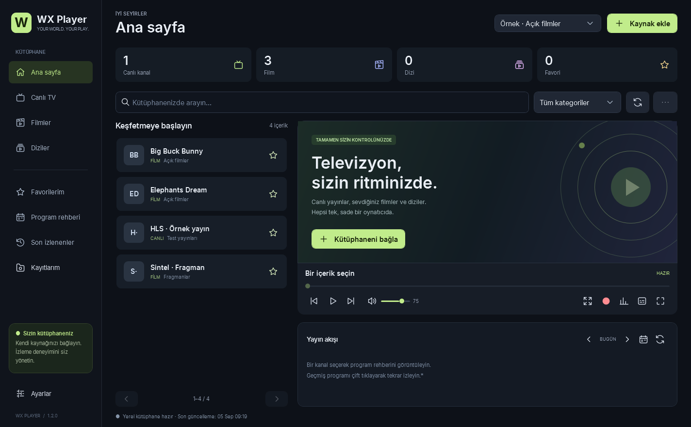

# WX Player 1.2

**Kendi kaynağınız. Kendi kütüphaneniz.** Windows için C# / WPF ile geliştirilmiş yerel IPTV ve medya oynatıcısı. Koyu arayüz, Fluent tasarımından esinlenen kontroller, Direct3D video çıkışı ve SQLite tabanlı yerel veri altyapısı.



## 1.2 — Rehber, istatistikler ve otomatik güncelleme

* **XMLTV EPG Parser & Channel Matcher:** WX Player'ın kendi akış tabanlı ayrıştırıcısı ve kaynak bazında indekslenmiş kanal eşleştiricisi. Harici bir servis ya da bu isimde doğrulanmamış bir paket bağımlılığı kullanılmaz. Standart XMLTV DOCTYPE satırı dış kaynağa erişmeden işlenir; gzip içerik uzantı yerine imzasından tanınır. `tvg-id`, `tvg-name` ve XMLTV `display-name` bilgileri eşleştirilir. HD/FHD gibi kalite ekleri ad karşılaştırmasında ayıklanır; belirsiz eşleşme tahmin edilmez, elle seçim sunulur.
* Rehber, kaynak yüklendiğinde ve canlı kanal seçildiğinde otomatik hazırlanır. Geçerli önbellek 6 saat kullanılır; başarısız bağlantı 5 dakika sonra yeniden denenebilir. Aynı kaynak için eşzamanlı indirmeler birleştirilir. Hatalı/boş XMLTV önceki rehberi silmez. İzlenen kanalın rehberi gösterilir; hızlı kanal değişiminde eski yanıt yeni kanala uygulanmaz.
* Xtream `get_short_epg` ve `get_simple_data_table` yedek sorguları; get.php şeklindeki M3U bağlantısından hesap ve gerçek yayın kimliği keşfi. Unix saatleri önceliklidir, tarih metninde sunucunun bildirdiği saat dilimi kullanılır. XMLTV'de bitiş yoksa aynı kanalın sonraki başlangıcından türetilir; son program için süre uydurulmaz.
* Oynatıcının **istatistik** simgesi veya **I**: codec, çözünürlük, kaynak FPS, görüntü oranı, ses örnekleme hızı/kanal sayısı, varsa parça bit hızı, giriş hızı ve video sayaçları. Her saniye yenilenir; URL'nin hesap/token içerebilen yolu gizlenir. GPU tercihi istenen ayardır, gerçek GPU kullanım yüzdesi değildir. LibVLC'nin sunmadığı kapsayıcı/piksel formatı gibi alanlar tahmin edilmez.
* Modern **Ayarlar**: oynatma, kütüphane, güncellemeler sekmeleri; kaynak düzenleme/kaldırma, tüm favorileri veya izleme geçmişini temizleme. Silme işlemlerinde kapsam açıklanır ve onay istenir. Diskteki PVR kayıtları silinmez.
* **GitHub Releases güncelleyicisi:** [schwairex/WX-Player](https://github.com/schwairex/WX-Player) deposunu açılışta ve 4 saatte bir kontrol eder. Yeni kararlı sürüm arka planda indirilir, boyutu ve SHA-256 özeti doğrulanır; ardından yeniden başlatma penceresi açılır. “Daha sonra” oynatmaya devam eder. Kayıt sürerken yeniden başlatma yapılmaz.

**1.1 kullanıcıları için:** 1.1 içinde güncelleyici yoktur; 1.2 EXE bir kez elle açılmalıdır. Sonraki sürümler bu sistemden alınabilir. Uygulama kapalıyken kontrol yapılamaz; açıkken kontrol aralığı 4 saattir, Ayarlar'dan anında kontrol edilebilir. EPG'nin görünmesi sağlayıcının o kanal/gün için program verisi sunmasına bağlıdır.

Güncelleme mevcut EXE'nin üzerine yazmaz. Doğrulanan yeni başlatıcı `updates` klasörüne alınır; önceki süreç kapandıktan sonra açılır. Yeni uygulama başarıyla ilklenince `active-update.txt` atomik olarak etkinleştirilir. 1.2 veya daha yeni eski başlatıcılar sonraki açılışta yeni sürüme yönlenir. Kullanıcı verileri aynı klasörde kalır; indirme/başlatma başarısızlığında önceki EXE korunur. Eski 1.0/1.1 kısayollarını 1.2 EXE'ye yönlendirin. Güncellemeler ve eski çıkarılmış paketler otomatik silinmez; yeterli boş alan bulunmalıdır. SHA-256 bütünlük kontrolüdür; kod imzalama sertifikasının yerine geçmez.

[GitHub'da yeni sürüm yayımlama](docs/GITHUB-RELEASES.md) · [1.2 test raporu](docs/TEST-REPORT-1.2.md)

## Korunan 1.1 arayüz ve tam ekran özellikleri

* **Inter** fontu Regular / Medium / SemiBold / Bold ağırlıklarıyla uygulamaya gömülüdür. Font kurulumu veya font için ağ bağlantısı gerekmez.
* Menü, arama, favori, EPG ve oynatıcı kontrollerinde aynı çizgi kalınlığına sahip özgün **SVG** simgeler kullanılır. SVG dosyaları `Assets/Icons` altındadır ve WPF vektör geometrisi olarak çizilir.
* Daha okunaklı yazı hiyerarşisi, sade menü, yumuşak yeşil vurgu, daha düzenli satırlar ve küçük pencerelerde simge menüsü.
* Video artık kendisine ayrılmış **yerel child HWND** içinde çizilir. Önceki LibVLCSharp.WPF saydam yardımcı pencere katmanı kaldırılmıştır; normal oynatımda arayüzün üzerinde karartıcı bir pencere bulunmaz. Video çözme ve Direct3D GPU desteği korunur.
* **Gerçek tam ekran:** monitörün çalışma alanı yerine fiziksel monitör sınırları kullanılır. Görev çubuğuna ve sabit alt kontrol satırına yer ayrılmaz. Video penceresi yeniden oluşturulmadan büyütülür; yayın kesilmez.
* Kontroller fare hareketiyle görünür; **2,5 saniye** hareketsizlikte gizlenir. Kontrollerin üzerindeyken görünür kalır. `F`, videoya çift tıklama ve `Esc` desteklenir.
* **Z** veya oynatıcıdaki sığdır/doldur düğmesi görüntü modunu değiştirir. Tam ekranda varsayılan **ekranı doldur** modudur: en-boy oranı korunur, oran farkı varsa kenarlar kırpılır. **Sığdır** modunda görüntünün tamamı korunur; oran farkında boşluk olabilir. Kaynak dosyaya görüntü olarak gömülmüş siyah şeritler otomatik algılanmaz.
* Tam ekrandan çıkışta normal veya büyütülmüş önceki pencere durumu geri yüklenir. Kaynaklar, favoriler, EPG, kayıtlar ve kullanıcı ayarları aynı veri klasöründe kalır.

**Güncelleme:** Eski uygulamayı kapatıp yeni EXE'yi çalıştırın. Kütüphaneyi yeniden eklemeniz gerekmez. Tek EXE, yeni bileşenleri ayrı bir sürüm klasörüne çıkarır.
## Çalıştırma

Windows 10/11 **x64** içindir. Windows 11 önerilir. Dağıtım .NET 10 çalışma zamanını ve LibVLC'yi içerir; ayrıca VLC veya .NET 10 kurmanız gerekmez. Tek dosya başlatıcısı Windows'un .NET Framework 4.x bileşenini kullanır.

* **WXPlayer.exe**: Tek dosyadır. İlk açılışta bileşenleri `%LOCALAPPDATA%\WXPlayer\application\1.2.0-<paket özeti>` konumuna çıkarır, sonraki açılışlarda bu kopyayı kullanır. Yönetici yetkisi veya sistem kurulumu istemez. İlk açılış için yaklaşık 500 MB boş alan ayırın.
* **WXPlayer-win-x64.zip**: Taşınabilir dağıtım. ZIP'in **tamamını** bir klasöre çıkarın ve içindeki `WXPlayer.exe` dosyasını çalıştırın. İçindeki EXE'yi tek başına başka klasöre taşımayın.
* EXE henüz ticari kod imzalama sertifikasıyla imzalanmamıştır. Paket bütünlüğü `SHA256SUMS.txt` ile doğrulanabilir.

## İlk kullanım

1. **Kaynak ekle** ile bağlantı türünü seçin.
2. M3U/M3U8/TXT dosyası veya URL girin; Xtream için sunucu, kullanıcı adı ve şifreyi yazın. `get.php?username=...&password=...` bağlantısını yapıştırırsanız hesap bilgileri ayrıştırılır. Stalker için sağlayıcının portal uç noktasını ve hesabınıza tanımladığı MAC adresini girin.
3. Kaydet ve yükle. İlerleme alt çubukta görünür; **İptal** mevcut kütüphaneyi korur. Bir kaynağın yüklemesi başarısız olursa önceki veriler silinmez.
4. Bir içeriğe tıklayın. Xtream dizilerinde bölüm seçicisi açılır. Yıldız favoriyi değiştirir. Filtreler, arama ve sayfa düğmeleri büyük listelerde de kullanılabilir.
5. Canlı kanal seçildiğinde yayın akışı otomatik yüklenir. M3U başlığından veya Xtream hesabından XMLTV adresi keşfedilir. Kaynağınız rehber adresi vermiyorsa kaynak ayarlarına XMLTV URL/dosyasını ekleyin. Yayın akışındaki eşleştirme düğmesiyle kanal kimliğini elle seçebilir, yenile düğmesiyle önbelleği güncelleyebilirsiniz.

Uygulama abonelik, ücretli kanal, hesap veya içerik sunmaz. Örnek kütüphane düğmesi açık lisanslı Blender filmlerinin bağlantılarını yükler; bu bağlantıların kullanılabilirliği uzaktaki sunucuya bağlıdır.

## Özellikler ve kapsam

| Özellik | Bu sürümdeki uygulama |
|---|---|
| M3U / M3U8 / TXT | UTF-8/BOM, EXTINF, grup, tvg-id, rehber adresi, göreli URL, kullanıcı aracısı ve referrer; M3U8 medya/master manifestini tek yayın olarak açma |
| Xtream Codes | Hesap doğrulama, canlı TV / VOD / dizi kategorileri, isteğe bağlı bölüm yükleme, kısa EPG, XMLTV ve timeshift URL üretimi |
| Stalker | MAG uyumlu handshake, profil, tür/kategori, sayfalı katalog, create_link; temel bölüm listeleri. Sağlayıcının cihaz ve oturum varyantlarına göre uyarlama gerekebilir |
| Büyük kütüphane | Akış halinde ayrıştırma, arka plan işi, SQLite WAL, atomik işlem, iptal, 150 satırlık sayfalar ve WPF satır sanallaştırması |
| Akıllı arama | 250 ms gecikmeli arama; Türkçe karakterleri sadeleştirme; kategori, tür, favori ve geçmiş filtreleri; önceki sorguyu iptal etme |
| Yerel önbellek | Kalıcı katalog; açılışta yeniden indirme gerektirmez. Elle yenileme. Ağ tamponu ayarlanabilir; tekrarlayan tamponlamada sonraki yayının tamponu artar |
| Windows medya | LibVLC 3.0.23 / LibVLCSharp 3.10.1; Direct3D 11 veya 9; D3D11VA GPU çözme, yazılım çözme seçeneği |
| DirectShow | Kaynak menüsünden Windows kamera/yakalama aygıtını adıyla açma. Ana IPTV oynatma hattı LibVLC + Direct3D'dir; ayrı özel DirectShow filtre grafiği değildir |
| Ses / altyazı | Akıştaki parça seçimi, harici SRT/ASS/SSA/VTT/SUB ekleme, sessiz, ses seviyesi |
| PVR | Ayrı oynatıcıyla TS remux kaydı, kayıt sırasında kanal değiştirme, kayıt klasörünü açma, kapanışta dosyayı tamamlama |
| Catch-Up | XMLTV geçmiş programını çift tıklama; Xtream timeshift ve `{utc}`, `{utcend}`, `{duration}`, `${start}`, `${end}` M3U şablonları |
| EPG | Kanal/gün rehberi, şimdi/sıradaki/geçmiş, ilerleme çizgisi, XMLTV ve XMLTV.gz, program açıklaması araç ipucu |
| Arayüz | Kategorili ana sayfa, sayaçlar, canlı TV / film / dizi / favoriler, kompakt simge menüsü, tam ekran, koyu başlık çubuğu |

**Sağlayıcıya bağlı sınırlar:** Gerçek Xtream/Stalker aboneliği verilmediği için bu entegrasyonlar kontrollü API yanıtlarıyla test edildi. Portal sürümleri; MAC dışında seri numarası, device ID, ek kimlik doğrulama veya farklı dizi uç noktaları isteyebilir. Bu sürüm bunların hepsini kapsamaz. Stalker'a özel arşiv protokolü desteklenmez; Stalker kanallarında XMLTV rehberi kullanılabilir. Xtream Catch-Up URL'si UTC saatinden üretilir; farklı sunucu saat dilimi bekleyen sağlayıcılar için uyarlama gerekir. Catch-Up için sağlayıcı arşivi gerekir; canlı yayında ileri/geri sarma ancak akış seek destekliyorsa mümkündür.

PVR, sağlayıcınızda ikinci bir eşzamanlı bağlantı açar. Bu sürümde zamanlanmış kayıt, kapalı uygulamada kayıt, yerel timeshift halkası, DRM/Widevine/PlayReady ve abonelik yönetim sunucusu yoktur. Kayıt TS kabına yeniden paketlenir; uyumsuz codec/kaynaklar kaydedilemeyebilir. DirectShow aygıt keşfi otomatik değildir; Windows aygıtının tam adı girilir. Bu teslimat kendi istemci/veri altyapınızı sağlar, bir IPTV içerik sunucusu kurmaz.

## Kısayollar

| Girdi | İşlem |
|---|---|
| Space | Oynat / duraklat |
| ← / → | Desteklenen akışta 10 saniye geri / ileri |
| ↑ / ↓ | Ses +5 / −5 (yukarı artırır) |
| F / Esc | Tam ekranı aç-kapat / tam ekrandan çık |
| M | Sessiz |
| Z | Sığdır / ekranı doldur |
| I | Yayın istatistikleri |
| Page Up / Page Down | Önceki / sonraki içerik; sayfa sınırından devam eder |
| Ctrl+K | Aramaya odaklan |
| Video üzerinde tekerlek | Ses seviyesini değiştir |
| Liste üzerinde tekerlek | Listeyi kaydır |
| Videoya çift tık | Tam ekran |
| Geçmiş EPG programına çift tık | Destekleniyorsa tekrar izle |

Metin ve şifre alanlarına yazarken oynatıcı kısayolları devreye girmez.

## Veri ve mahremiyet

Veriler `%LOCALAPPDATA%\WXPlayer` altında kalır. Uygulama analitik veya telemetri servisine bağlanmaz. Ağ istekleri eklediğiniz kaynaklara, seçtiğiniz yayınlara ve güncelleme kontrolü/indirmesi için GitHub Releases sunucularına gider. GitHub sunucusuna IPTV hesabı veya yayın adresi gönderilmez.

* Kaynak yapılandırması ve hesap şifreleri Windows DPAPI `CurrentUser` ile şifrelenir; başka kullanıcıya veya başka bilgisayara doğrudan taşınamaz.
* `library.db`: katalog, favoriler, son izlenenler, EPG. **Oynatma listesinden gelen yayın URL'leri ve başlıkları bu SQLite dosyasında düz metindir**; URL içine gömülü token/şifreler de buna dahildir. Xtream yayın URL'leri mümkün olduğunda oynatma anında hesap bilgilerinden üretilir.
* `settings.json`: hassas olmayan ayarlar. `errors.log`: yalnız hata türü ve zaman; kaynak URL'leri loglanmaz.
* Kaynak silme o kaynağın kataloğunu, favorilerini, geçmişini ve rehberini kaldırır. Kayıt dosyaları ayrıca kullanıcı tarafından yönetilir.
* Tam kaldırma: uygulamayı kapatın, uygulama klasörünü ve istenirse `%LOCALAPPDATA%\WXPlayer` verilerini silin. Kayıtlar varsayılan olarak Videolar/WX Player altındadır.

## Kaynaktan geliştirme

Gerekli: Windows x64, **.NET 10 SDK**, NuGet erişimi. WPF kaynakları normal Visual Studio veya başka C# editöründe açılabilir.

```powershell
dotnet build WXPlayer.sln -c Release
dotnet run --project src/WXPlayer.App -c Release
dotnet run --project tests/WXPlayer.Tests -c Release -- artifacts/test-results.json
./tools/build.ps1
```

`build.ps1` testleri çalıştırır, çalışma zamanı dahil taşınabilir ZIP ve tek dosya başlatıcı EXE üretir. Çıktı klasörü varsayılan `artifacts`; tekrar paketlerken yeni bir `-OutputPath` verin. Tek EXE üretiminde Windows .NET Framework 4 C# derleyicisi kullanılır; ana uygulama .NET 10'dur. Kod imzalama sertifikası bu depoya dahil değildir.

```text
src/WXPlayer.Core    modeller, ayrıştırma, sağlayıcılar, XMLTV, SQLite, DPAPI
src/WXPlayer.App     WPF, oynatıcı motoru, diyaloglar, klavye/fare, görsel test
tests/WXPlayer.Tests bağımsız ağsız doğrulama programı, 100.500 içerik testi
tools               EXE başlatıcısı ve yeniden üretilebilir paketleme betiği
samples             açık lisanslı örnek içerik bağlantıları
.github/workflows   Windows CI derleme ve paketleme
```

Başlangıç ve medya testleri izole veri klasörüyle çalıştırılabilir:

```powershell
./artifacts/WXPlayer-win-x64/WXPlayer.exe --smoke --stress --data-dir C:\Temp\WXPlayer-QA --media C:\Temp\test.mp4
```

Bu test gerçek WPF penceresini oluşturur, PNG önizlemeleri ve JSON sonuç dosyası yazar; yerel MP4 ile video, seek, pause, ses parçaları, harici altyazı ve PVR/yeniden oynatma işlemlerini dener. `--stress`, içe aktarma sırasında UI zamanlayıcısının çalıştığını ölçer. Medya testi dosyanın desteklenen ve seek edilebilir olmasını gerektirir. Başlatıcıyı izole denemek için `WXPLAYER_APP_ROOT` ortam değişkeni çıkarma klasörünü değiştirebilir.

## GitHub'a yükleme

Kaynak ZIP'i çıkarın; **içindeki proje dosyalarını** yeni GitHub deponuza yükleyin. ZIP'in kendisini kaynak ağacı yerine yüklemeyin. EXE/taşınabilir ZIP, büyük dosya olduklarından deponun **Releases** bölümüne eklenebilir. Depoda özel kullanıcı bilgileri, gerçek abonelik URL'leri veya veritabanı bulunmaz. GitHub'a yükleme bu teslimat sırasında yapılmadı.

Uygulama kodu MIT lisanslıdır. Dahil edilen codec bileşenlerinin lisansları ayrıdır; `THIRD-PARTY-NOTICES.md` ve `licenses/` dosyalarını koruyun. Özel multimedya motoru sıfırdan yazılmış değildir; WX Player kendi uygulama ve veri katmanları üzerinde açık kaynak LibVLC'yi kullanır.

