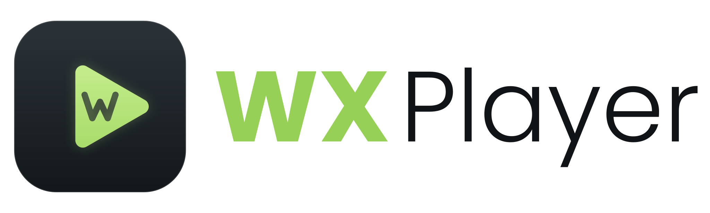
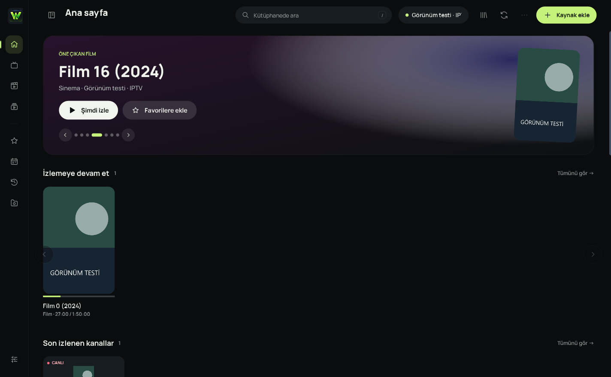
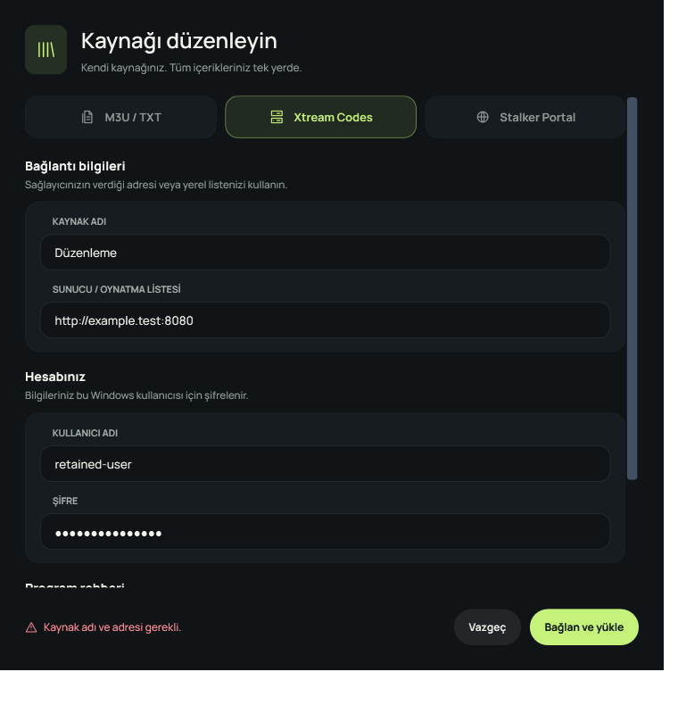

<div align="center">

<picture>
  <source media="(prefers-color-scheme: dark)" srcset="docs/assets/branding/wx-logo-horizontal-light-text.svg">
  <source media="(prefers-color-scheme: light)" srcset="docs/assets/branding/wx-logo-horizontal-dark-text.svg">
  
</picture>

### Kendi yayınların. Tek bir ekran.

Canlı TV, filmler ve diziler için Windows’a özel bir IPTV oynatıcısı.  
Kütüphaneni keşfet, kaldığın yerden devam et ve yayın akışını takip et.

<p>
  <a href="https://github.com/schwairex/WX-Player/releases/latest"></a>
  
  
  <a href="LICENSE"></a>
</p>

**[Windows için indir](https://github.com/schwairex/WX-Player/releases/latest)** · **[İlk kurulum](#ilk-kurulum)** · **[Özellikler](#izleme-deneyimi)** · **[Belgeler](docs/INDEX.md)**



<sub>Ekran görüntüleri izole test kütüphanesinden alınmıştır. Uygulama kendi kaynağındaki içerikleri kullanır.</sub>

</div>

---

## İzleme deneyimi

| Canlı yayında | Film ve dizilerde | Kendi kütüphanende |
| :--- | :--- | :--- |
| Kanal listesi, yayın rehberi ve oynatıcı aynı ekranda. | Afişli raflar, sezon/bölüm seçimi ve kaldığın yerden devam. | M3U, Xtream Codes ve uyumlu Stalker kaynaklarını bir arada yönet. |

**WX Player**, eklediğin kaynakları yerel bir kütüphanede toplar. Koyu masaüstü arayüzü, ikonlu sol menü ve klavye kısayollarıyla içeriklerine hızlıca ulaşabilirsin.

| Özellik | Sana sunduğu |
| --- | --- |
| **Kaynak ve arama** | M3U/M3U8/TXT dosyası veya URL’si, Xtream Codes, uyumlu Stalker/MAG; kategori, arama ve büyük listelerde sayfalama. |
| **Film ve dizi deneyimi** | Afiş rafları, izleme ilerlemesi, sezon/bölüm seçimi ve sonraki bölüm önerisi. Arama sırasında öne çıkan afiş sabit kalır. |
| **Yayın rehberi** | XMLTV/XMLTV.gz ve Xtream EPG; geçmiş, mevcut ve sonraki programlar; sağlayıcı destekliyorsa Catch-Up. |
| **Oynatıcı** | LibVLC, tam ekran kütüphanesi, çoklu ses/altyazı, harici altyazı, mini oynatıcı ve teknik istatistikler. |
| **Geri sarma ve kayıt** | Desteklenen canlı HTTP/HTTPS akışlarda 60 saniyeye kadar yerel tampon; canlı kayıt ve film/diziden seçilen aralığı klip olarak kaydetme. |
| **Kişiselleştirme** | Favoriler, son izlenenlerden tekli kaldırma, afiş/logo önbelleği ve isteğe bağlı Discord Rich Presence. |
| **Yeniden açılış** | Ana sayfada başlar; son seçilen kaynağı ve izleme konumlarını hatırlar. |
| **Güncellemeler** | GitHub Releases üzerinden sürüm denetimi ve indirme; SHA-256 doğrulaması ve onayla yeniden başlatma. |

[**Tüm özellikler ve kısayollar →**](docs/guides/FEATURES.md)

## İlk kurulum

1. [Releases sayfasından](https://github.com/schwairex/WX-Player/releases/latest) tek dosyalı **`WXPlayer-<sürüm>.exe`** paketini indir ve çalıştır. Portable ZIP kullanıyorsan arşivi tamamen çıkarıp içindeki `WXPlayer.exe` dosyasını aç.
2. **Kaynak ekle** ile M3U dosyanı/URL’ni veya sağlayıcının Xtream/Stalker bilgilerini gir.
3. İçe aktarma tamamlandığında **Ana sayfa**, **Canlı TV**, **Filmler** ve **Diziler** bölümlerinden izlemeye başla.

> **Windows 10 / 11 · x64.** Dağıtım paketleri .NET 10 çalışma zamanı ve LibVLC içerir. Hazır EXE/portable paketini kullanmak için SDK yüklemen gerekmez.

[**Ayrıntılı kurulum ve kaynak türleri →**](docs/guides/INSTALLATION.md)

## Uygulamadan görüntüler

<details>
<summary><strong>Filmler ve diziler</strong> — afiş rafları ve öne çıkan içerik</summary>


</details>

<details>
<summary><strong>Canlı TV</strong> — kanal listesi ve yatay yayın rehberi</summary>


<sub>WPF katmanı yakalanmıştır; bu yöntem yerel video HWND’sini siyah gösterebilir.</sub>

</details>

<details>
<summary><strong>Kaynak ekle ve düzenle</strong> — M3U, Xtream ve Stalker</summary>



</details>

## Kısayollar

| Tuş | İşlem | Tuş | İşlem |
| --- | --- | --- | --- |
| `Space` | Oynat / duraklat | `F` / `Esc` | Tam ekran / çıkış |
| `←` / `→` | Desteklenen akışta 10 sn geri / ileri | `M` | Sesi kapat / aç |
| `Ctrl+K` | Arama | `Ctrl+B` | Sol menüyü aç / daralt |
| `L` | Tam ekran kütüphanesi | `P` | Normal pencerede mini oynatıcı |

[Diğer kısayollar ve tam ekran tuşları](docs/guides/FEATURES.md#kısayollar).

## Belgeler ve geliştirme

| Başlamak istediğin yer | Belge |
| --- | --- |
| Kurulum ve kaynak ekleme | [Kurulum kılavuzu](docs/guides/INSTALLATION.md) |
| Oynatma, kayıt, EPG ve kısayollar | [Özellikler](docs/guides/FEATURES.md) |
| Discord’da izleme durumunu gösterme | [Discord Rich Presence](docs/guides/DISCORD-PRESENCE.md) |
| Kaynaktan build ve test | [Geliştirme kılavuzu](docs/guides/DEVELOPMENT.md) |
| Kaynak dosyalarının sorumlulukları | [Proje yapısı](docs/guides/PROJECT-STRUCTURE.md) |
| GitHub’da README/logo yükleme | [GitHub yükleme kılavuzu](docs/guides/GITHUB-README.md) |
| Sürüm yayımlama ve otomatik güncelleme | [GitHub Releases](docs/guides/GITHUB-RELEASES.md) |

```text
WXPlayer/
├── src/
│   ├── WXPlayer.App/       # WPF: Shell, Views, Controls, Themes, Services
│   └── WXPlayer.Core/      # Providers, Library, Epg, Playback, Discord
├── tests/                  # Regresyon ve güncelleme testleri
├── docs/                   # Kılavuzlar, görseller, sürüm geçmişi
├── design/                 # Onaylanan HTML tasarım referansları
├── tools/                  # EXE/portable paketleme ve güncelleme araçları
└── WXPlayer.sln
```

## Son değişiklikler

| Sürüm | Öne çıkan |
| --- | --- |
| [**1.7.13**](docs/releases/notes/RELEASE-NOTES-1.7.13.md) | Kaynak penceresi, ortak oynatıcı görünümü, arama/kategori düzeltmeleri, sabit afiş ve son kaynağı hatırlama. |
| [**1.7.12**](docs/releases/notes/RELEASE-NOTES-1.7.12.md) | Yayın istatistikleri, mini oynatıcı ve ses/altyazı pencerelerinin yenilenmesi. |
| [**1.7.11**](docs/releases/notes/RELEASE-NOTES-1.7.11.md) | Ortak sidebar, yeni Ayarlar tasarımı ve pencere odak davranışı düzeltmeleri. |

[**Tüm sürüm geçmişi →**](docs/CHANGELOG.md) · [1.7.13 doğrulama raporu](docs/validation/reports/TEST-REPORT-1.7.13.md)

## Destek ve lisans

Hata veya öneri paylaşmak için [Issues](https://github.com/schwairex/WX-Player/issues) sayfasını kullanabilirsin. Sorun bildirirken sürümü ve adımları ekle; özel yayın adresini veya sağlayıcı şifreni paylaşma.

WX Player içerik veya IPTV aboneliği sağlamaz. Kullanmak için erişim hakkın olan bir kaynak gerekir. Uygulama [MIT](LICENSE), üçüncü taraf bileşenler kendi [lisansları](THIRD-PARTY-NOTICES.md) altındadır. Discord Rich Presence isteğe bağlıdır; özel yayın URL’leri ve sağlayıcı kimlik bilgileri activity’ye gönderilmez.

<div align="center">

<picture>
  <source media="(prefers-color-scheme: dark)" srcset="docs/assets/branding/wx-logo-horizontal-light-text.svg">
  <source media="(prefers-color-scheme: light)" srcset="docs/assets/branding/wx-logo-horizontal-dark-text.svg">
  
</picture>

[İndir](https://github.com/schwairex/WX-Player/releases/latest) · [Belgeler](docs/INDEX.md) · [Sorun bildir](https://github.com/schwairex/WX-Player/issues)

</div>
