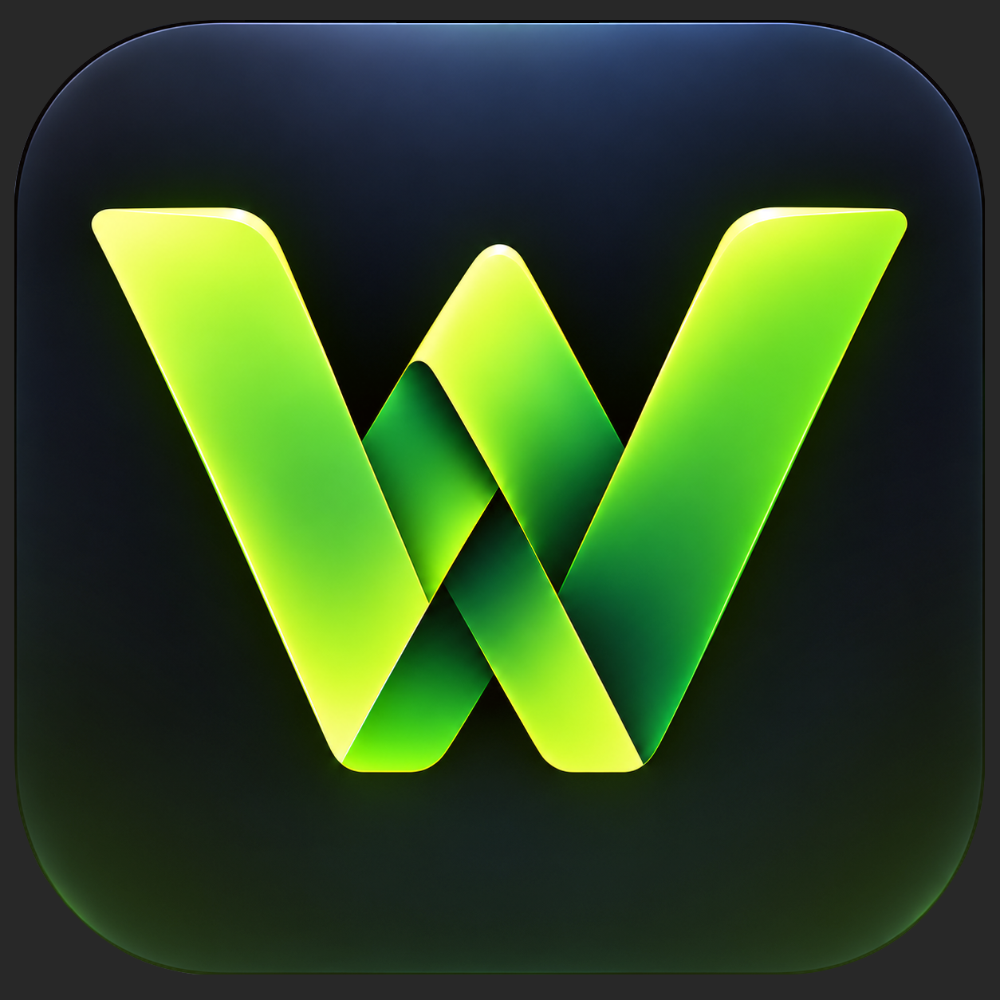
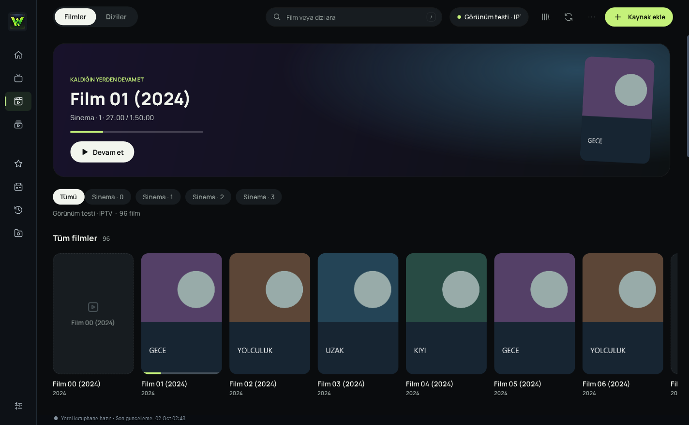

<div align="center">



# WX Player

**Kendi kaynağınızdan canlı TV, film ve dizi izlemek için Windows oynatıcısı.**

<p>
  <a href="https://github.com/schwairex/WX-Player/releases/latest"></a>
  
  
  <a href="LICENSE"></a>
</p>

**[İndir](https://github.com/schwairex/WX-Player/releases/latest)** · **[Kurulum](#kurulum)** · **[Özellikler](#özellikler)** · **[Sürüm geçmişi](#sürüm-geçmişi)** · **[Sorun bildir](https://github.com/schwairex/WX-Player/issues)**


<sub>Görüntü örnek test kütüphanesinden alınmıştır. WX Player içerik veya IPTV aboneliği sağlamaz.</sub>

</div>

WX Player, eklediğiniz M3U, Xtream Codes ve uyumlu Stalker kaynaklarını yerel bir kütüphanede toplar. Film ve dizi sayfalarında gerçek kaynağınızdaki afişler yatay raflarda gösterilir; canlı TV için oynatıcı ve yayın rehberi aynı ekrandadır. Kullanmak için erişim hakkınız olan bir kaynak gerekir.

## Özellikler

| Bölüm | Yapabilecekleriniz |
| --- | --- |
| **Kaynaklar** | M3U/M3U8/TXT URL veya dosyası, Xtream Codes API ve uyumlu Stalker/MAG portalı. |
| **Kütüphane** | Büyük listeleri arka planda içe aktarma; SQLite katalog, sayfalama, kategori ve arama. |
| **Keşif** | Ana sayfada öneriler, son izlenenler ve favoriler; Filmler/Diziler sayfalarında afişli yatay raflar. |
| **Oynatma** | LibVLC ile canlı TV, film ve dizi; çoklu ses/altyazı, harici altyazı, donanım veya yazılım çözme. |
| **Devam etme** | Filmin konumunu, dizinin son bölümünü ve izleme konumunu saklama; yenilenen bölüm seçimi ve sonraki bölüm önerisi. |
| **Yayın akışı** | XMLTV/XMLTV.gz ve Xtream EPG; izlenen kanalın mevcut programı, sonraki yayınlar ve uygun sağlayıcılarda Catch-Up. |
| **Canlı yayın** | Desteklenen HTTP/HTTPS akışlarda son 60 saniyeye kadar yerel geri sarma ve canlıya dönüş; manuel kayıt (PVR) ve isteğe bağlı kanal sağlık göstergesi. |
| **Mini oynatıcı ve klip** | Videoyu ayrı, üstte tutulan mini pencerede izleme; film/dizide kayıt düğmesiyle başlangıç ve bitiş seçip kısa klip kaydetme. |
| **Kişiselleştirme** | Favoriler, son izlenenlerden tekli kaldırma, görsel önbelleği ve isteğe bağlı Discord Rich Presence. |
| **Güncelleme** | GitHub Releases üzerinden sürüm denetimi, indirme, SHA-256 doğrulaması ve onayla yeniden başlatma. |

<details>
<summary>Film ve dizi raflarının görünümünü aç</summary>




<sub>Görünüm testi için üretilmiş afişler. Uygulama kendi kütüphanenizdeki içerikleri kullanır.</sub>
</details>

<details>
<summary>Canlı TV görünümünü aç</summary>


<sub>İzole QA kütüphanesi. WPF görsel katmanı yakalanmıştır; yerel video HWND'si bu görüntü yönteminde siyah görünür.</sub>
</details>

## Kurulum

**Gereksinim:** Windows 10 veya 11, x64. Yayınları ve çevrimiçi görselleri almak için internet bağlantısı gerekir. Dağıtım paketine .NET 10 çalışma zamanı ve LibVLC dahildir.

1. [En son kararlı sürümü](https://github.com/schwairex/WX-Player/releases/latest) açın.
2. Tek dosyalı dağıtım için **`WXPlayer.exe`** dosyasını indirin ve çalıştırın. Dilerseniz **`WXPlayer-win-x64.zip`** dosyasını çıkarıp taşınabilir sürümdeki `WXPlayer.exe` dosyasını çalıştırın.
3. **Kaynak ekle** düğmesiyle oynatma listenizi veya sağlayıcı bilgilerinizi girin. İçe aktarma tamamlanınca ana sayfa, kategoriler ve arama kullanılabilir.

| Kaynak türü | Girilecek bilgi | Not |
| --- | --- | --- |
| M3U / M3U8 / TXT | URL veya yerel dosya | Liste metadata'sındaki kategori, logo ve EPG bağlantısı okunur. |
| Xtream Codes | Sunucu adresi, kullanıcı adı, şifre | Canlı TV, film, dizi ve desteklenen EPG verileri alınır. |
| Stalker / MAG | Portal adresi, hesabınıza ait MAC adresi | Portalın sunduğu uyumlu katalog kullanılır. |

Kaynağınız afiş ya da kanal logosu sağlamıyorsa uygulama uygun herkese açık görseli arayabilir; bulunamazsa okunabilir bir varsayılan kart kullanır. Görsel bulunması garanti değildir. [Kaynak ve kullanım ayrıntıları](docs/RELEASE-DELIVERY.md).

## İzleme deneyimi

- **Filmler ve Diziler:** Sol menüden ilgili sayfayı açın. Gerçek kütüphane kategorileri yatay afiş rafları olarak görünür. Arayın, rafları kaydırın veya bir içeriği favorileyin. Dizi kartını seçtikten sonra sezon ve bölümü belirleyin.
- **Canlı TV:** Kanal seçildiğinde onun EPG'si oynatıcının altında açılır. Yatay EPG kartları geçmiş, şimdiki ve sonraki programları gösterir; mevcut program ilerlemesi kartın içinde yer alır. Oynatıcı dişli menüsünden kayıt, PiP, ses/altyazı ve istatistik seçeneklerine ulaşılır. Rehber gelmiyorsa sağlayıcının EPG bağlantısını ve kanal eşleşmesini kontrol edin.
- **Tam ekran:** Başlık, tek kontrol çubuğu ve sağdan açılan kütüphane gerçek kaynak verisiyle çalışır. `L` veya menü düğmesiyle paneli açıp kapatabilirsiniz; panel kapalıyken oynatma sırasında 3,5 saniye hareketsizlikten sonra kontroller gizlenir. Canlı TV'nin yerel 60 saniye tamponu yalnız desteklenen akışlarda işler.
- **Mini oynatıcı ve sağlık:** Oynatıcıdaki mini pencere düğmesi veya `P` ile izlemeyi ayrı pencerede sürdürüp geri dönebilirsiniz. Ayarlar'da mini oynatıcıyı kapatabilir veya canlı kanallar için isteğe bağlı sağlık göstergesini açabilirsiniz. Gösterge oynatmanın başlayıp başlamadığını kontrol eder; tüm yayın boyunca kesintisiz çalışacağını garanti etmez.
- **Kayıt:** Canlı TV kaydı seçilen kanal akışını dosyaya yazar. Film ve dizide kayıt düğmesine ilk basış başlangıcı, ikinci basış bitişi belirler; klip seçilen aralıktan dışa aktarılır. Akış kopyalama nedeniyle başlangıç ve bitiş en yakın anahtar kareye kayabilir.
- **Veriler:** Favoriler, geçmiş ve kaynaklar yerel veri klasöründe tutulur. Discord Rich Presence varsayılan olarak kapalıdır; açıldığında özel yayın adresleri ve sağlayıcı kimlik bilgileri paylaşılmaz. [Discord kurulumu ve gizlilik](docs/DISCORD-PRESENCE.md).

### Kısayollar

| Tuş | İşlem | Tuş | İşlem |
| --- | --- | --- | --- |
| `Space` | Oynat / duraklat | `F`, `Esc` | Tam ekran / çıkış |
| `←`, `→` | Desteklenen akışta 10 sn geri / ileri | `↑`, `↓` | Sesi 5 artır / azalt |
| `M` | Sesi kapat / aç | `Z` | Görüntüyü sığdır / doldur |
| `Page Up`, `Page Down` | Önceki / sonraki içerik | `I` | Yayın istatistikleri |
| `Ctrl+K` | Arama | `Ctrl+B` | Sol menüyü aç / daralt |
| `P` | Normal pencerede mini oynatıcı; tam ekranda önceki bölüm/içerik | `L` | Tam ekranda kütüphaneyi aç / kapat |

Fare tekerleği içerik sayfasını kaydırır; video üzerindeyken sesi ayarlar. Rafları `Shift + tekerlek` ile yatay kaydırabilirsiniz.

## Güncelleme ve sürüm yayımlama

Uygulama açılışta ve arka planda yeni kararlı GitHub Release sürümünü kontrol eder. Hazır güncellemeyi Ayarlar'dan görebilir ve yeniden başlatmayı seçebilirsiniz. İndirilen dosya kullanılmadan önce bütünlük denetiminden geçer. Ağ veya yayın varlığı uygun değilse mevcut kurulum çalışmaya devam eder.

**Release hazırlayanlar:** Eski sürümlerin de güncellenebilmesi için bir GitHub Release'e yalnız **bir** WX Player Windows x64 dağıtım EXE'si yükleyin. Sürümlü teslim dosyasını `WXPlayer.exe` olarak yeniden adlandırabilirsiniz; iki adını aynı anda yüklemeyin. Portable ve kaynak ZIP dosyaları eklenebilir. Adımlar: [GitHub Releases kılavuzu](docs/GITHUB-RELEASES.md).

## Kaynaktan geliştirme

Windows üzerinde .NET 10 SDK gerekir. Depo kökünden:

```powershell
dotnet restore WXPlayer.sln
dotnet build WXPlayer.sln -c Release
dotnet run --project tests/WXPlayer.Tests -c Release
dotnet run --project src/WXPlayer.App -c Release -- --smoke --home-layout-only --data-dir C:\Temp\WXPlayer-Home-QA
```

Tam oynatma smoke testi için `--media` ile oynatılabilir yerel bir video dosyası ekleyin. Paket oluşturma:

```powershell
powershell.exe -NoProfile -ExecutionPolicy Bypass -File .\tools\build.ps1 -OutputPath .\artifacts
```

`src/WXPlayer.App` WPF arayüzünü ve oynatıcıyı, `src/WXPlayer.Core` kaynakları ve kütüphaneyi, `tests/WXPlayer.Tests` regresyon testlerini, `tools` dağıtım araçlarını içerir. [Tasarım sistemi](docs/DESIGN_SYSTEM.md) · [1.7.13 test raporu](docs/TEST-REPORT-1.7.13.md).

Tam ekranda `N` sonraki bölüm/içerik, `R` kayıt ve `C` ses/altyazı menüsünü açar. Kategori/sayfalama seçenekleri için kütüphane arama alanına sağ tıklayın.

## Sürüm geçmişi

| Sürüm | Başlıca değişiklik |
| --- | --- |
| **[1.7.13](docs/RELEASE-NOTES-1.7.13.md)** | HTML referanslı Kaynak ekle/düzenle; tüm oynatıcı sayfalarında ortak görünüm; arama hizası, tüm kaynak kategorileri ve sabit arama afişi; son kaynakla Ana sayfa açılışı ve yeni logo. |
| **[1.7.12](docs/RELEASE-NOTES-1.7.12.md)** | HTML referanslı Yayın istatistikleri, Mini oynatıcı ve Ses/altyazılar görünümü; sabit teknik özet, sade mini kontroller, ortak seçici/kart stilleri. Mevcut oynatma, seçim ve veri akışları korunur. |
| **[1.7.11](docs/RELEASE-NOTES-1.7.11.md)** | Tüm sayfalarda ortak Canlı TV sidebarı; HTML referanslı beş bölümlü Ayarlar görünümü; sade video başlığı ve tam ekran kaynak rozeti; diğer uygulamaların öne gelmesini engelleyen üstte tutma davranışı düzeltildi. |
| **[1.7.10](docs/RELEASE-NOTES-1.7.10.md)** | Canlı TV v3 görünümü: tam yükseklikte kanal paneli, video üzerinde özgün kontroller ve yatay EPG kartları; mevcut işlevler korunur. |
| **[1.7.9](docs/RELEASE-NOTES-1.7.9.md)** | Geçersiz logo/afiş adresi yüzünden yerel M3U içe aktarmanın tamamen geri alınması düzeltildi; gerçek büyük dosya ve üç yeni regresyonla doğrulandı. |
| **[1.7.8](docs/RELEASE-NOTES-1.7.8.md)** | HTML referansı ile Ana sayfa: tek arama, eğik hero afişi, türlere ayrılmış devam/favori satırları, ortak afiş kartları, 16:10 kanal kartları ve sayfa sonu durum notu. |
| **[1.7.7](docs/RELEASE-NOTES-1.7.7.md)** | Referans HTML'ye göre Filmler/Diziler görünümü: sabit başlık, Manrope, ölçeklenen afiş rafları, gerçek izleme konumlu hero ve afişsiz kartlar. |
| **[1.7.6](docs/RELEASE-NOTES-1.7.6.md)** | v2 tam ekran tasarımı, ekrana göre rem ölçeklendirmesi, bölüm/favori kütüphanesi, gerçek hız ve ses/altyazı menüleri. |
| **[1.7.5](docs/RELEASE-NOTES-1.7.5.md)** | Uzun duraklatma sonrası bölümün kaldığı yerden devam etmesi; referans tam ekran düzeni, açılır kütüphane ve tek kontrol çubuğu. |
| **[1.7.4](docs/RELEASE-NOTES-1.7.4.md)** | Tam ekran video yüzeyinin boyutu düzeltildi; mini oynatıcı düzeni yenilendi; yerel render başlığı gizlendi. |
| **[1.7.3](docs/RELEASE-NOTES-1.7.3.md)** | Mini oynatıcı görüntü yüzeyi ve arayüzü, hızlı duraklat/devam et, bölümün başa dönmesini önleme, afişli sinematik ana sayfa karuseli. |
| **[1.7.2](docs/RELEASE-NOTES-1.7.2.md)** | Bölüm ve tam ekran arayüzleri, mini oynatıcı, isteğe bağlı kanal sağlığı ve film/dizi klip kaydı. |
| **[1.7.1](docs/RELEASE-NOTES-1.7.1.md)** | Afişli film/dizi katalogları, yeni WX simgesi, okunabilir canlı TV rehberi, sade README. |
| **[1.7.0](docs/RELEASE-NOTES-1.7.0.md)** | Koyu masaüstü arayüzü, açılır ikon menüsü ve daha güvenilir Release varlığı seçimi. |
| **[1.6.3](docs/RELEASE-NOTES-1.6.3.md)** | Discord'da uygun afiş/logo; canlı TV süre çubuğunu gizleme. |
| **[1.6.2](docs/RELEASE-NOTES-1.6.2.md)** | İsteğe bağlı Discord Rich Presence. |
| **[1.6.1](docs/RELEASE-NOTES-1.6.1.md)** | Son izlenenleri tek tek kaldırma; yenilenen film/dizi önerileri. |
| **[1.6.0](docs/RELEASE-NOTES-1.6.0.md)** | Dizi bölüm geçişleri ve eksik görselleri tamamlama. |
| **[1.5.3](docs/RELEASE-NOTES-1.5.3.md)** | Kaydırma ve görsel önbelleği iyileştirmeleri. |
| **[1.5.2](docs/RELEASE-NOTES-1.5.2.md)** | Ana sayfa görsel yerleşimi. |
| **[1.5.1](docs/RELEASE-NOTES-1.5.1.md)** | Film/dizi ayrımı, bölüm ve ilerleme görünümü. |
| **[1.5.0](docs/RELEASE-NOTES-1.5.0.md)** | Ana sayfa ve tam ekran gezinmesi. |
| **[1.4.0](docs/RELEASE-NOTES-1.4.0.md)** | Canlı geri sarma ve tam ekran kategorileri. |
| **[1.3.0](docs/RELEASE-NOTES-1.3.0.md)** | Arama, kontroller ve yayın akışı düzeni. |
| **[1.2.0](docs/RELEASE-NOTES-1.2.0.md)** | EPG, istatistikler, ayarlar ve GitHub güncellemeleri. |

## Katkı ve lisans

Hata veya geliştirme önerilerini [Issues](https://github.com/schwairex/WX-Player/issues) üzerinden paylaşabilirsiniz. Uygulama kodu [MIT lisansı](LICENSE) altındadır; üçüncü taraf bileşenler ve örnek medya kendi lisanslarına tabidir. WX Player yalnız istemcidir; IPTV aboneliği veya yayın sağlamaz.


