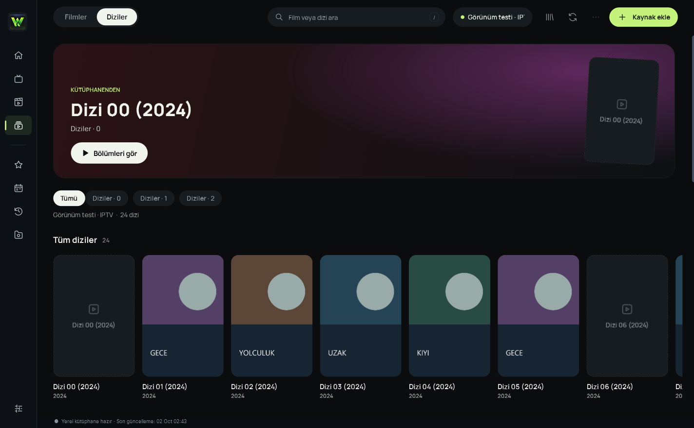
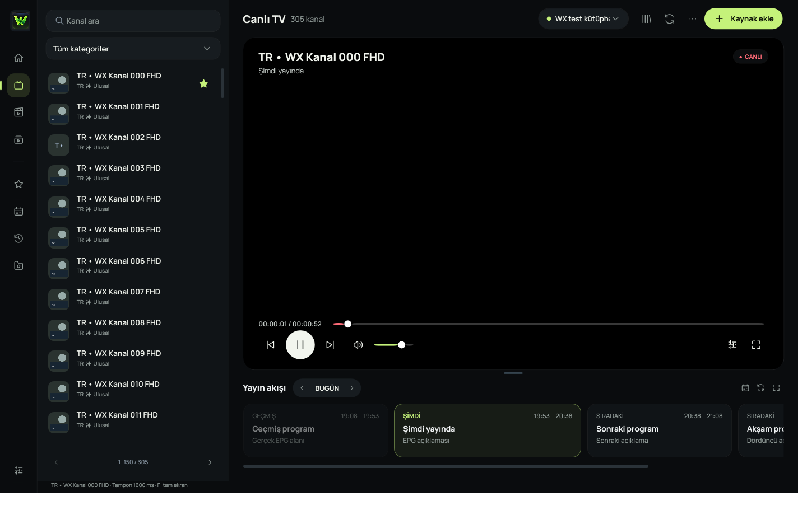

# Özellikler

| Bölüm | Yapabilecekleriniz |
| --- | --- |
| **Kaynaklar** | M3U/M3U8/TXT URL veya dosyası, Xtream Codes API ve uyumlu Stalker/MAG portalı. |
| **Kütüphane** | Büyük listeleri arka planda içe aktarma; SQLite katalog, sayfalama, kategori ve arama. |
| **Keşif** | Ana sayfada öneriler, son izlenenler ve favoriler; Filmler/Diziler sayfalarında afişli yatay raflar. |
| **Oynatma** | LibVLC ile canlı TV, film ve dizi; çoklu ses/altyazı, harici altyazı, donanım veya yazılım çözme. |
| **Devam etme** | Filmin konumunu, dizinin son bölümünü ve izleme konumunu saklama; yenilenen bölüm seçimi ve sonraki bölüm önerisi. |
| **Yayın akışı** | XMLTV/XMLTV.gz ve Xtream EPG; izlenen kanalın mevcut programı, sonraki yayınlar ve uygun sağlayıcılarda Catch-Up. |
| **Canlı yayın** | Desteklenen HTTP/HTTPS akışlarda son 60 saniyeye kadar yerel geri sarma ve canlıya dönüş; manuel kayıt (PVR) ve isteğe bağlı kanal sağlık göstergesi. |
| **Mini oynatıcı ve klip** | Videoyu ayrı, üstte tutulan mini pencerede izleme; film/dizide kayıt düğmesiyle başlangıç ve bitiş seçip kısa klip kaydetme. |
| **Kişiselleştirme** | Favoriler, son izlenenlerden tekli kaldırma, görsel önbelleği ve isteğe bağlı Discord Rich Presence. |
| **Güncelleme** | GitHub Releases üzerinden sürüm denetimi, indirme, SHA-256 doğrulaması ve onayla yeniden başlatma. |

Film ve dizi raflarının görünümünü aç

Görünüm testi için üretilmiş afişler. Uygulama kendi kütüphanenizdeki içerikleri kullanır.

Canlı TV görünümünü aç

İzole QA kütüphanesi. WPF görsel katmanı yakalanmıştır; yerel video HWND'si bu görüntü yönteminde siyah görünür.

## İzleme deneyimi

- **Filmler ve Diziler:** Sol menüden ilgili sayfayı açın. Gerçek kütüphane kategorileri yatay afiş rafları olarak görünür. Arayın, rafları kaydırın veya bir içeriği favorileyin. Dizi kartını seçtikten sonra sezon ve bölümü belirleyin.
- **Canlı TV:** Kanal seçildiğinde onun EPG'si oynatıcının altında açılır. Yatay EPG kartları geçmiş, şimdiki ve sonraki programları gösterir; mevcut program ilerlemesi kartın içinde yer alır. Oynatıcı dişli menüsünden kayıt, PiP, ses/altyazı ve istatistik seçeneklerine ulaşılır. Rehber gelmiyorsa sağlayıcının EPG bağlantısını ve kanal eşleşmesini kontrol edin.
- **Tam ekran:** Başlık, tek kontrol çubuğu ve sağdan açılan kütüphane gerçek kaynak verisiyle çalışır. `L` veya menü düğmesiyle paneli açıp kapatabilirsiniz; panel kapalıyken oynatma sırasında 3,5 saniye hareketsizlikten sonra kontroller gizlenir. Canlı TV'nin yerel 60 saniye tamponu yalnız desteklenen akışlarda işler.
- **Mini oynatıcı ve sağlık:** Oynatıcıdaki mini pencere düğmesi veya `P` ile izlemeyi ayrı pencerede sürdürüp geri dönebilirsiniz. Ayarlar'da mini oynatıcıyı kapatabilir veya canlı kanallar için isteğe bağlı sağlık göstergesini açabilirsiniz. Gösterge oynatmanın başlayıp başlamadığını kontrol eder; tüm yayın boyunca kesintisiz çalışacağını garanti etmez.
- **Kayıt:** Canlı TV kaydı seçilen kanal akışını dosyaya yazar. Film ve dizide kayıt düğmesine ilk basış başlangıcı, ikinci basış bitişi belirler; klip seçilen aralıktan dışa aktarılır. Akış kopyalama nedeniyle başlangıç ve bitiş en yakın anahtar kareye kayabilir.
- **Veriler:** Favoriler, geçmiş ve kaynaklar yerel veri klasöründe tutulur. Discord Rich Presence varsayılan olarak kapalıdır; açıldığında özel yayın adresleri ve sağlayıcı kimlik bilgileri paylaşılmaz. [Discord kurulumu ve gizlilik](../guides/DISCORD-PRESENCE.md).

### Kısayollar

| Tuş | İşlem | Tuş | İşlem |
| --- | --- | --- | --- |
| `Space` | Oynat / duraklat | `F`, `Esc` | Tam ekran / çıkış |
| `←`, `→` | Desteklenen akışta 10 sn geri / ileri | `↑`, `↓` | Sesi 5 artır / azalt |
| `M` | Sesi kapat / aç | `Z` | Görüntüyü sığdır / doldur |
| `Page Up`, `Page Down` | Önceki / sonraki içerik | `I` | Yayın istatistikleri |
| `Ctrl+K` | Arama | `Ctrl+B` | Sol menüyü aç / daralt |
| `P` | Normal pencerede mini oynatıcı; tam ekranda önceki bölüm/içerik | `L` | Tam ekranda kütüphaneyi aç / kapat |

Fare tekerleği içerik sayfasını kaydırır; video üzerindeyken sesi ayarlar. Rafları `Shift + tekerlek` ile yatay kaydırabilirsiniz.

Tam ekranda `N` sonraki bölüm/içerik, `R` kayıt, `C` ses/altyazı menüsüdür. Kategori/sayfalama seçenekleri kütüphane arama alanının sağ tık menüsünde bulunur.

[İlk kurulum](INSTALLATION.md) · [README](../../README.md).
